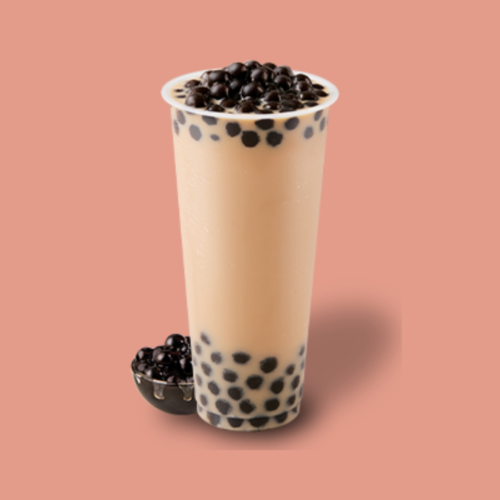
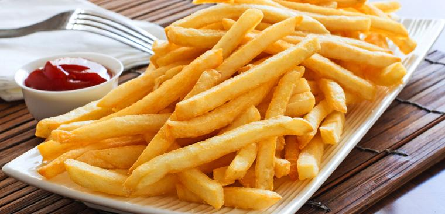
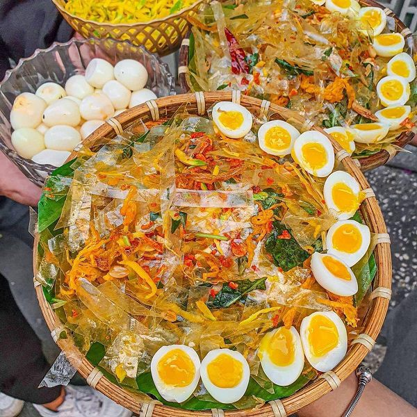
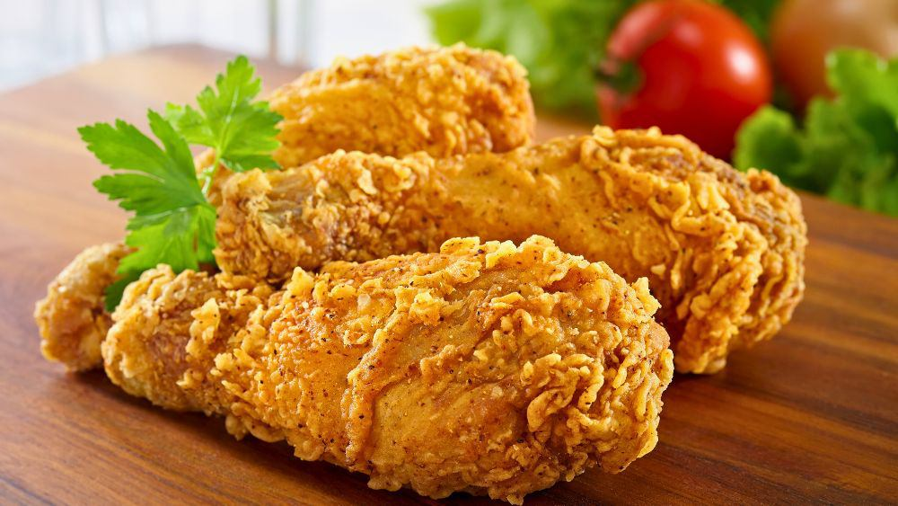
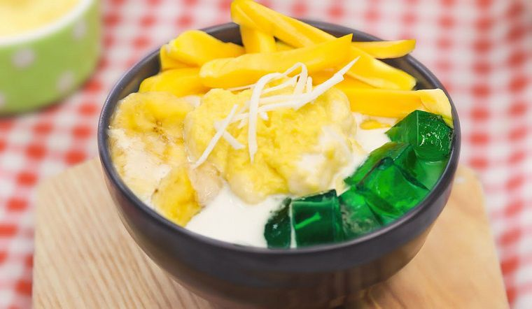
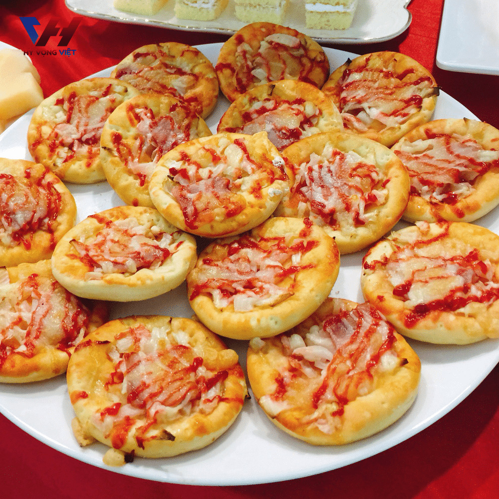
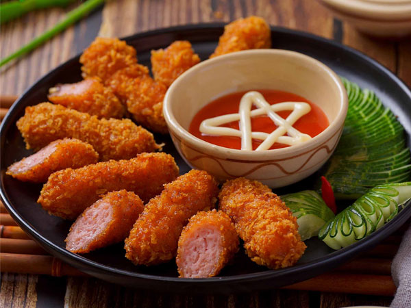
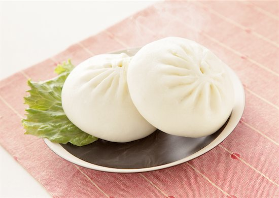
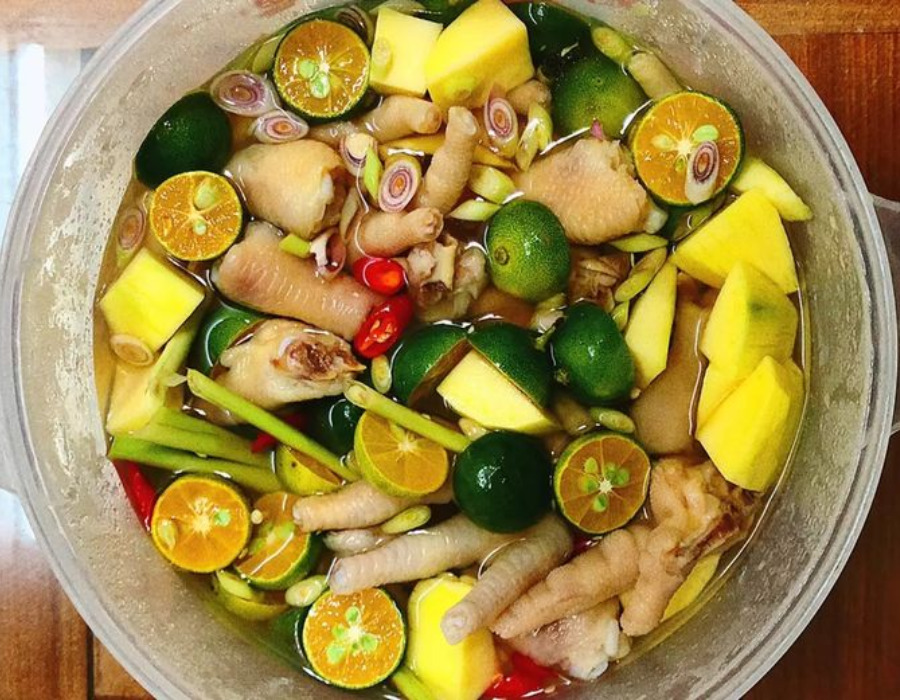

<html lang="en">
<head>
    <meta charset="UTF-8">
    <meta name="viewport" content="width=device-width, initial-scale=1.0">   
    <title>Food Shop - Đồ Ăn Vặt</title>
    
</head>
<body>
    <header>
        <h1>Food Shop - Đồ Ăn Vặt Ngon</h1>
    </header>
    <nav>
        <a href="#menu">Menu</a>
        <a href="#gallery">Hình Ảnh</a>
        <a href="#survey">Khảo Sát</a>
        <a href="https://shopeefood.vn" target="_blank">Shopee Food</a>
    </nav>

    <section class="menu" id="menu">
        <h2>Thực Đơn</h2>
        <table>
            <thead>
                <tr>
                    <th>Món Ăn</th>
                    <th>Giá</th>
                    <th>Mô Tả</th>
                </tr>
            </thead>
            <tbody>
                <tr>
                    <td>Trà Sữa Trân Châu</td>
                    <td>30,000 VND</td>
                    <td>Thức uống giải khát, ngọt ngào.</td>
                </tr>
                <tr>
                    <td>Khoai Tây Chiên</td>
                    <td>20,000 VND</td>
                    <td>Khoai tây chiên giòn, ngon miệng.</td>
                </tr>
                <tr>
                    <td>Bánh Tráng Trộn</td>
                    <td>25,000 VND</td>
                    <td>Bánh tráng dai, vị đậm đà.</td>
                </tr>
                <tr>
                    <td>Gà Rán</td>
                    <td>40,000 VND</td>
                    <td>Gà rán giòn tan, thơm ngon.</td>
                </tr>
                <tr>
                    <td>Chè Thái</td>
                    <td>35,000 VND</td>
                    <td>Chè Thái thơm ngon, ngọt lịm.</td>
                </tr>
                <tr>
                    <td>Pizza Mini</td>
                    <td>50,000 VND</td>
                    <td>Pizza nhỏ xinh, đủ vị thơm ngon.</td>
                </tr>
                <tr>
                    <td>Sushi Cuộn</td>
                    <td>60,000 VND</td>
                    <td>Sushi cuộn tươi ngon, hấp dẫn.</td>
                </tr>
                <tr>
                    <td>Nem Chua Rán</td>
                    <td>30,000 VND</td>
                    <td>Nem chua rán giòn, đậm đà.</td>
                </tr>
                <tr>
                    <td>Bánh Bao</td>
                    <td>15,000 VND</td>
                    <td>Bánh bao nhân thịt thơm ngon.</td>
                </tr>
                <tr>
                    <td>Chân Gà Sả Tắc</td>
                    <td>40,000 VND</td>
                    <td>Chân gà sả tắc chua cay hấp dẫn.</td>
                </tr>
            </tbody>
        </table>
    </section>

    <section class="gallery" id="gallery">
        <h2>Hình Ảnh Món Ăn</h2>
        
        
        
        
        
        
        
        
        
        
    </section>

    <section class="offer">
        
Ưu Đãi Đặc Biệt: Giảm 10% cho hóa đơn trên 100,000 VND!

    </section>

    <section class="survey" id="survey">
        <h2>Khảo Sát Sự Hài Lòng</h2>
        <form action="#" method="post">
            <label for="name">Tên của bạn:</label>
            <input type="text" id="name" name="name" required>

            <label for="rating">Bạn đánh giá thế nào về chất lượng món ăn?</label>
            <select id="rating" name="rating">
                <option value="excellent">Tuyệt vời</option>
                <option value="good">Tốt</option>
                <option value="average">Bình thường</option>
                <option value="poor">Kém</option>
            </select>

            <label for="feedback">Ý kiến đóng góp:</label>
            <textarea id="feedback" name="feedback" rows="4"></textarea>

            <button type="submit">Gửi Khảo Sát</button>
        </form>
    </section>

    <section class="contact">
        <h2>Liên Hệ</h2>
        
Số điện thoại: 0853534500

        
Facebook: <a href="https://www.facebook.com/share/14tfycsk2a/" target="_blank">Chủ Quán</a>

    </section>
</body>
</html>
